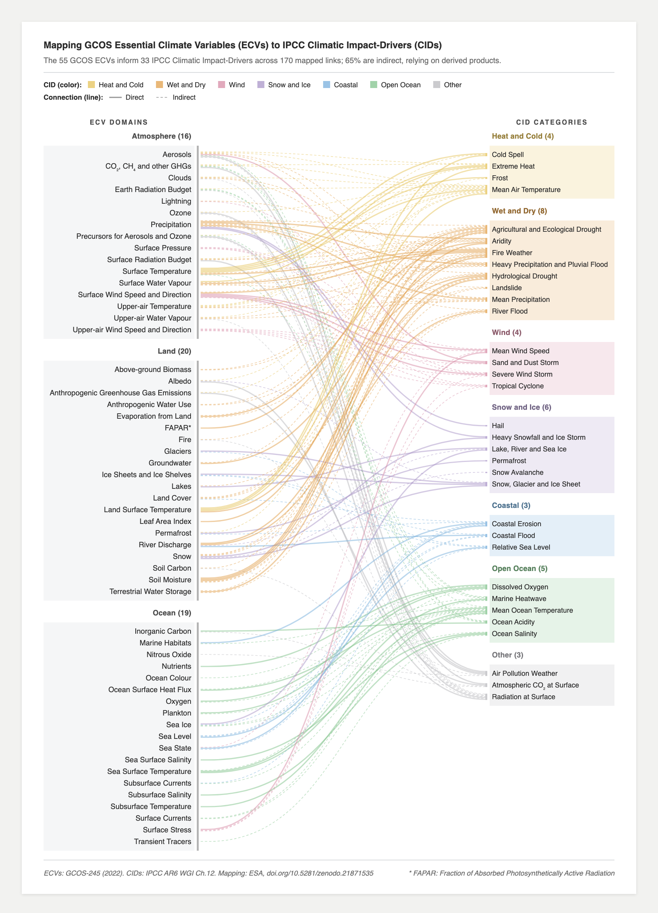

# Sankeys linking Essential Climate Variables to the IPCC AR6 Climatic Impact-Drivers

*Companion code for the workbook "Mapping GCOS ECVs and ESA ECV projects to IPCC AR6 Climatic Impact-Drivers" ([10.5281/zenodo.21871535](https://doi.org/10.5281/zenodo.21871535)).*


The workbook maps two sets of climate variables onto the 33 IPCC AR6 Climatic Impact-Drivers (CIDs): the 55 GCOS Essential Climate Variables (ECVs), and the ESA Climate Change Initiative (CCI) ECV projects. One Sankey diagram is produced for each mapping.



The corresponding [ESA CCI Sankey](sankeys/esa-ecv-cid.png) is also included.


## Setup

Download the workbook from https://doi.org/10.5281/zenodo.21871535 and place it in `./data/`, then run:

```bash
pip install -r requirements.txt
python ecv_cid_sankey.py both
```

This writes `gcos-ecv-cid.html` and `esa-ecv-cid.html` to the current
directory and opens them in a browser. The generated files are self-contained and render offline.

| Argument / option | Effect |
|---|---|
| `gcos` \| `esa` \| `both` | Which figure(s) to build (positional) |
| `--workbook PATH` | Path to the mapping workbook |
| `--outdir PATH` | Where to write the HTML (default: current directory) |
| `--no-open` | Write the files without opening a browser |


## Data interpretation

Input data comes from the workbook tabs **`4.2 GCOS ECV-CID Mapping`** and **`5.2 ESA ECV-CID Mapping`**:

| Column | Description |
|---|---|
| `ecv_domain` | Earth-system domain the ECV belongs to. GCOS uses Atmosphere, Land and Ocean; ESA adds a Cryosphere domain. |
| `ecv_source` | The ECV / ESA CCI ECV project |
| `cid_target` | The IPCC AR6 CID |
| `cid_type` | The CID category |
| `value` | Connection type: direct / indirect |


## Configuration

Everything that differs between the two Sankeys lives in the `FIGURES` dictionary. Both figures are fixed at 790 px wide (A4 portrait at 96 dpi), so widening a label gutter narrows the flows rather than the page. Row height adapts to fit the A4 height, down to `ROW_MIN`, beyond which the figure will run onto a second page.

The script warns on stderr for unrecognised CID categories or domains, unexpected `value` entries, rows with a blank endpoint, and ECVs filed under more than one domain.

## Licence

Code is [MIT](LICENSE). The workbook and the figures generated from it are [CC BY 4.0](https://creativecommons.org/licenses/by/4.0/). Bundles `d3-selection` (ISC, © 2010–2021 Mike Bostock), see [`vendor/d3-selection-LICENSE.txt`](vendor/d3-selection-LICENSE.txt).